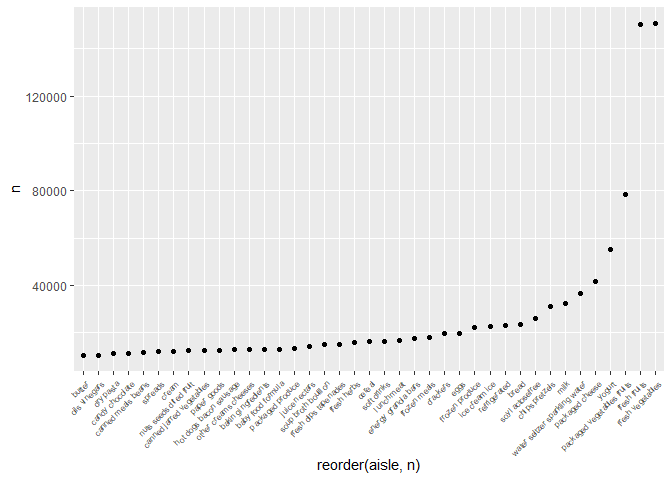
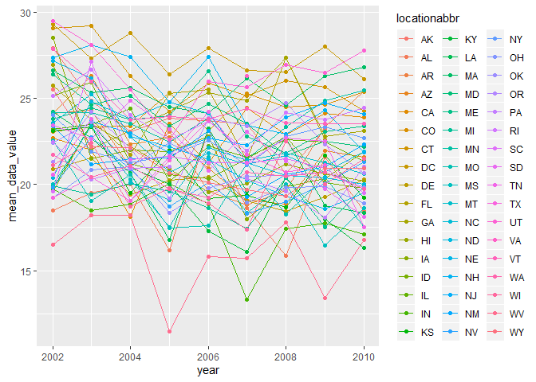
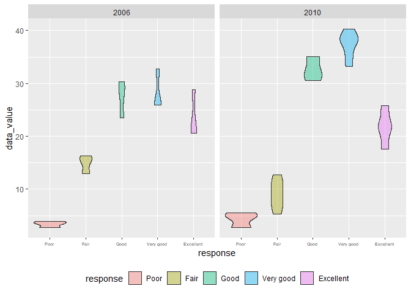
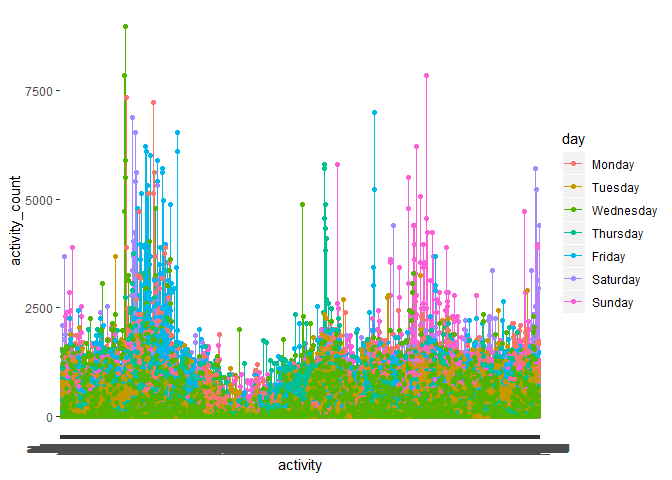
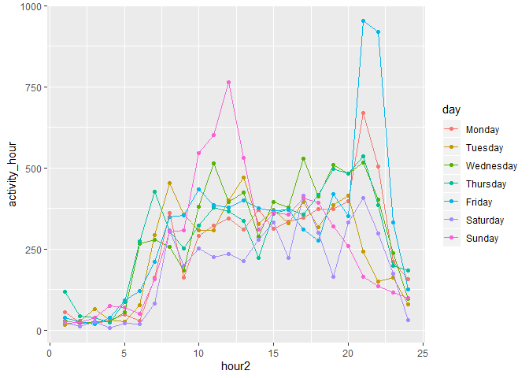
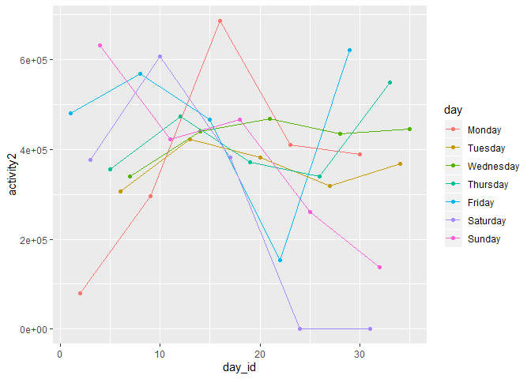
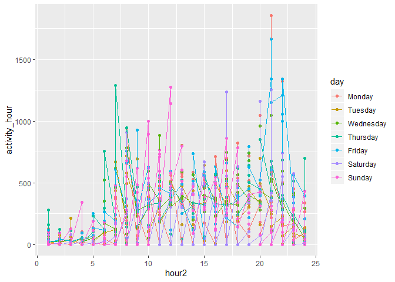

p8105\_hw3\_dd2948
================
David DeStephano
October 7, 2019

``` r
library(tidyverse)
```

    ## -- Attaching packages --------------------------------------------------------------------- tidyverse 1.2.1 --

    ## v ggplot2 3.2.1     v purrr   0.3.2
    ## v tibble  2.1.3     v dplyr   0.8.3
    ## v tidyr   1.0.0     v stringr 1.4.0
    ## v readr   1.3.1     v forcats 0.4.0

    ## -- Conflicts ------------------------------------------------------------------------ tidyverse_conflicts() --
    ## x dplyr::filter() masks stats::filter()
    ## x dplyr::lag()    masks stats::lag()

Problem 1
---------

``` r
library(p8105.datasets)
data("instacart")

instacart %>%
  group_by(aisle) %>%
  summarize(n = n()) %>% 
  arrange(desc(n))
```

    ## # A tibble: 134 x 2
    ##    aisle                              n
    ##    <chr>                          <int>
    ##  1 fresh vegetables              150609
    ##  2 fresh fruits                  150473
    ##  3 packaged vegetables fruits     78493
    ##  4 yogurt                         55240
    ##  5 packaged cheese                41699
    ##  6 water seltzer sparkling water  36617
    ##  7 milk                           32644
    ##  8 chips pretzels                 31269
    ##  9 soy lactosefree                26240
    ## 10 bread                          23635
    ## # ... with 124 more rows

``` r
#Alternatively:
count(instacart, aisle)
```

    ## # A tibble: 134 x 2
    ##    aisle                      n
    ##    <chr>                  <int>
    ##  1 air fresheners candles  1067
    ##  2 asian foods             7007
    ##  3 baby accessories         306
    ##  4 baby bath body care      328
    ##  5 baby food formula      13198
    ##  6 bakery desserts         1501
    ##  7 baking ingredients     13088
    ##  8 baking supplies decor   1094
    ##  9 beauty                   287
    ## 10 beers coolers           1839
    ## # ... with 124 more rows

``` r
#Fresh vegatables is the most popular
```

The dimensions of this data set are 1384617, 15 Key Variables The most ordered from aisle is fresh vegeatables

Plot
====

``` r
instacart %>%
  group_by(aisle) %>%
  summarize(n = n()) %>% 
  filter(n>10000) %>% 
  arrange(desc(n)) %>% 
  ggplot(aes(x = reorder(aisle, n), y = n)) + 
    geom_point() + geom_line() + 
    theme(axis.text.x = element_text(size=6, angle = 45, hjust = 1))
```

    ## geom_path: Each group consists of only one observation. Do you need to
    ## adjust the group aesthetic?



Table showing the tree most popular items in each of the aisles: baking ingredients, dog food care, packaged vegetables fruits
==============================================================================================================================

``` r
instacart %>%
  filter(aisle %in% c('baking ingredients', 'dog food care', 'packaged vegetables fruits')) %>% 
  group_by(aisle, product_name) %>% 
  summarize(n = n()) %>%  
  arrange(aisle, desc(n)) %>%
  slice(1:3)
```

    ## # A tibble: 9 x 3
    ## # Groups:   aisle [3]
    ##   aisle                     product_name                                  n
    ##   <chr>                     <chr>                                     <int>
    ## 1 baking ingredients        Light Brown Sugar                           499
    ## 2 baking ingredients        Pure Baking Soda                            387
    ## 3 baking ingredients        Cane Sugar                                  336
    ## 4 dog food care             Snack Sticks Chicken & Rice Recipe Dog T~    30
    ## 5 dog food care             Organix Chicken & Brown Rice Recipe          28
    ## 6 dog food care             Small Dog Biscuits                           26
    ## 7 packaged vegetables frui~ Organic Baby Spinach                       9784
    ## 8 packaged vegetables frui~ Organic Raspberries                        5546
    ## 9 packaged vegetables frui~ Organic Blueberries                        4966

Make a table showing the mean hour of the day at which Pink Lady Apples and Coffee Ice Cream are ordered on each day of the week; format this table for human readers (i.e. produce a 2 x 7 table)
==================================================================================================================================================================================================

``` r
instacart %>%
  filter(product_name %in% c('Pink Lady Apples', 'Coffee Ice Cream')) %>% 
  group_by(product_name, order_dow) %>% 
  summarize(mean_time = mean(order_hour_of_day)) %>% 
  pivot_wider(
    names_from = product_name,
    values_from = mean_time)  
```

    ## # A tibble: 7 x 3
    ##   order_dow `Coffee Ice Cream` `Pink Lady Apples`
    ##       <int>              <dbl>              <dbl>
    ## 1         0               13.8               13.4
    ## 2         1               14.3               11.4
    ## 3         2               15.4               11.7
    ## 4         3               15.3               14.2
    ## 5         4               15.2               11.6
    ## 6         5               12.3               12.8
    ## 7         6               13.8               11.9

``` r
  #make 2 by 7.. format days
```

Problem 2
---------

``` r
library(p8105.datasets)
data("instacart")
data("BRFSS")
```

    ## Warning in data("BRFSS"): data set 'BRFSS' not found

``` r
brfss <- 
    brfss_smart2010 %>% 
    janitor::clean_names() %>%
  filter(topic=="Overall Health") %>% 
  mutate(response = as.factor(response)) %>% 
  mutate(response =
           factor(response,levels(response)[c(4,2,3,5,1)]))


brfss %>% 
  filter(year==2002) %>%
  group_by(locationabbr) %>% 
  summarize(n_state =n_distinct(locationdesc)) %>% 
  filter(n_state>=7)
```

    ## # A tibble: 6 x 2
    ##   locationabbr n_state
    ##   <chr>          <int>
    ## 1 CT                 7
    ## 2 FL                 7
    ## 3 MA                 8
    ## 4 NC                 7
    ## 5 NJ                 8
    ## 6 PA                10

In 2002, Connectiticut, Florida, Massachusetts, North Carolina, New Jersey, Pennsylvania each were observed at 7 or more locations

``` r
brfss %>% 
  filter(year==2010) %>%
  group_by(locationabbr) %>% 
  summarize(n_state =n_distinct(locationdesc)) %>% 
  filter(n_state>=7)
```

    ## # A tibble: 14 x 2
    ##    locationabbr n_state
    ##    <chr>          <int>
    ##  1 CA                12
    ##  2 CO                 7
    ##  3 FL                41
    ##  4 MA                 9
    ##  5 MD                12
    ##  6 NC                12
    ##  7 NE                10
    ##  8 NJ                19
    ##  9 NY                 9
    ## 10 OH                 8
    ## 11 PA                 7
    ## 12 SC                 7
    ## 13 TX                16
    ## 14 WA                10

In 2010, CA, CO, FL, MA, MD, NC, NE, NJ, NY, OH were observed at 7 or more locations

Limited to excellent responses
==============================

``` r
spaghetti<-brfss %>% 
  filter(response=="Excellent") %>% 
  group_by(year, locationabbr) %>% 
  summarize(mean_data_value=mean(data_value))
```

Make a spaghetti plot
=====================

``` r
spaghetti %>% ggplot(aes(x = year, y = mean_data_value, color = locationabbr)) +
  geom_line(aes(group = locationabbr)) +
  geom_point()+ 
  viridis::scale_fill_viridis(discrete = TRUE)
```

    ## Warning: Removed 3 rows containing missing values (geom_path).

    ## Warning: Removed 4 rows containing missing values (geom_point).



``` r
brfss %>%
  filter(year == c(2006, 2010), locationabbr=="NY") %>%
  ggplot(aes(x = response, y = data_value))+
  geom_violin(aes(fill=response), alpha = .4)+
  facet_grid(~year)+ 
  theme(legend.position = "bottom", axis.text.x = element_text(size=5))
```

    ## Warning in year == c(2006, 2010): longer object length is not a multiple of
    ## shorter object length



Problem 3
---------

``` r
accel<-read_csv("./data/accel_data.csv") %>% 
  janitor::clean_names() %>% 
  pivot_longer(
    activity_1:activity_1440,
    names_to = "activity", 
    values_to = "activity_count") %>% 
  mutate(weekend=ifelse(day==("Saturday") | day==("Sunday"), 1, 0 )) %>% 
mutate(day=as.factor(day),
       day =
           factor(day,levels(day)[c(2,6,7,5,1, 3,4)]))
```

    ## Parsed with column specification:
    ## cols(
    ##   .default = col_double(),
    ##   day = col_character()
    ## )

    ## See spec(...) for full column specifications.

reasonable variable classes. Describe the resulting dataset (e.g. what variables exist, how many observations, etc).
====================================================================================================================

I am not sure what why the variable classes would not be reasonable The data set includes 6 variables: week, day\_id, day, activity, and weekend. There are 50400 rows and 6 columns, dimensions: 50400, 6

Traditional analyses of accelerometer data focus on the total activity over the day. Using your tidied dataset, aggregate accross minutes to create a total activity variable for each day, and create a table showing these totals. Are any trends apparent?
=============================================================================================================================================================================================================================================================

The sum for each specific day using the day id:

``` r
accel %>% 
  group_by(day_id) %>% 
  summarise(sum(activity_count))
```

    ## # A tibble: 35 x 2
    ##    day_id `sum(activity_count)`
    ##     <dbl>                 <dbl>
    ##  1      1               480543.
    ##  2      2                78828.
    ##  3      3               376254 
    ##  4      4               631105 
    ##  5      5               355924.
    ##  6      6               307094.
    ##  7      7               340115.
    ##  8      8               568839 
    ##  9      9               295431 
    ## 10     10               607175 
    ## # ... with 25 more rows

The combined sums for each day of the week using the day of the week variable:

``` r
accel %>% 
  group_by(day) %>% 
  summarise(sum(activity_count))
```

    ## # A tibble: 7 x 2
    ##   day       `sum(activity_count)`
    ##   <fct>                     <dbl>
    ## 1 Monday                 1858699.
    ## 2 Tuesday                1799238.
    ## 3 Wednesday              2129772.
    ## 4 Thursday               2091151.
    ## 5 Friday                 2291711.
    ## 6 Saturday               1369237 
    ## 7 Sunday                 1919213

No trends seem to be apparent. Friday has the highest daily activity levels, while saturday has the lowest, so maybe this person is very active on fridays but then sits around on saturdays. He seems to become most active from the middle of the week until friday

Ignore this plot
================

``` r
accel %>% ggplot(aes(x=activity, y=activity_count, color = day)) +
  geom_line()+
  geom_point()
```



Make a single-panel plot that shows the 24-hour activity time courses for each day and use color to indicate day of the week.
=============================================================================================================================

``` r
#Create an hour variable
accel2<- accel %>%
  mutate(activity2=sapply(strsplit(activity, split='_', fixed=TRUE), function(x) (x[2]))) %>% 
  mutate(hour=as.numeric(activity2)/60) %>% 
  mutate(hour2=ifelse(hour<=1, 1, 
ifelse(1<hour&hour<=2, 2, 
ifelse(2<hour&hour<=3, 3, 
       ifelse(3<hour&hour<=4, 4,
              ifelse(4<hour&hour<=5, 5,
                     ifelse(5<hour&hour<=6, 6,
                            ifelse(6<hour&hour<=7, 7,
                                   ifelse(7<hour&hour<=8, 8,
                                          ifelse(8<hour&hour<=9, 9,
                                                 ifelse(9<hour&hour<=10, 10,
                                                        ifelse(10<hour&hour<=11, 11,
                                                               ifelse(11<hour&hour<=12, 12,
                                                                      ifelse(12<hour&hour<=13, 13,
                                                                             ifelse(13<hour&hour<=14, 14,
                                                                                    ifelse(14<hour&hour<=15, 15,
                                                                                           ifelse(15<hour&hour<=16, 16,
                                                                                                  ifelse(16<hour&hour<=17, 17,
                                                                                                         ifelse(17<hour&hour<=18, 18,
                                                                                                                ifelse(18<hour&hour<=19, 19,
                                                                                                                       ifelse(19<hour&hour<=20, 20,
                                                                                                                              ifelse(20<hour&hour<=21, 21,
                                                                                                                                     ifelse(21<hour&hour<=22, 22,
                                                                                                                                            ifelse(22<hour&hour<=23, 23,
                                                                                                                                                   ifelse(23<hour&hour<=24, 24,0)))))))))))))))))))))))))
      #Is there a better way to do this with sapply or a for loop?   
         
#Plot
accel2 %>% 
  group_by(hour2, day) %>% 
  summarize(activity_hour=mean(activity_count)) %>% 
  ggplot(aes(x=hour2, y=activity_hour, color=day))+
  geom_point()+
  geom_line()
```

 The trend is that in the morning (12 AM to 4) this person is most likely asleep every day (except on thursday when he seems to sometimes be awake). He then wakes up and has a more or less constant activity level throughout the dat(except sunday) until 6PM, where he begins to either wind down on certain days, or exercise on other days.

``` r
accel2 %>% 
  group_by(hour2, day, day_id) %>% 
  summarize(activity_hour=mean(activity_count)) %>% 
  ggplot(aes(x=hour2, y=activity_hour, color=day))+
  geom_point()+
  geom_line()
```



If you want each day instead of hour for each day you can run the following code:
=================================================================================

``` r
accel %>% 
  group_by(day_id, day) %>% 
  summarize(activity2=sum(activity_count)) %>% 
  ggplot(aes(x=day_id, y=activity2, color=day))+
  geom_point()+
  geom_line()
```


``` r
accel2 %>% 
  group_by(hour2, day, day_id) %>% 
  summarize(activity_hour=mean(activity_count)) %>% 
  ggplot(aes(x=hour2, y=activity_hour, color=day))+
  geom_point()+
  geom_line()
```


